# White Label Login MVP V2

Source: `2026-04-02 White label Login MVP V2.pptx` (Ingo)

## Slide 1 - ACCOUNT Management

Goal: Add account management to new app, so we can soon give portfolio managers and portfolio companies access to the white-label app.

Add temporary subdomain: wista.impactforesight.io (best block search engines from indexing it)

## Slide 2 - Role Views

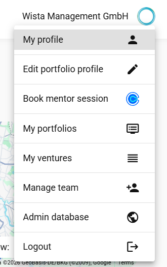
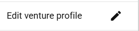

- Portfolio manager
- Portfolio company
- My portfolios: Should not be visible for WISTA portfolio companies, but for portfolio managers. Initially WISTA will have only one portfolio

## Slide 3 - Navigation

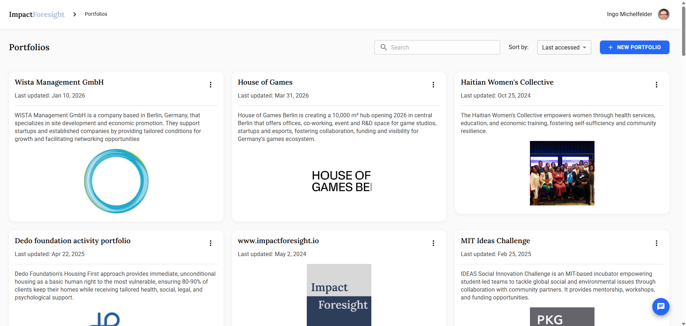
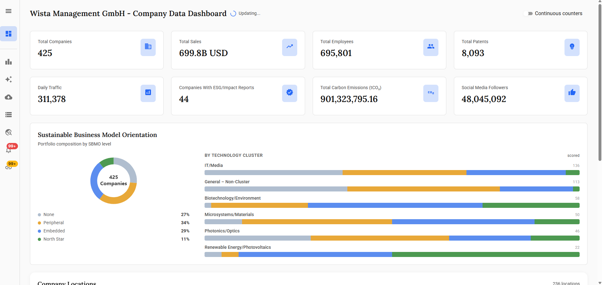
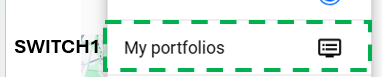
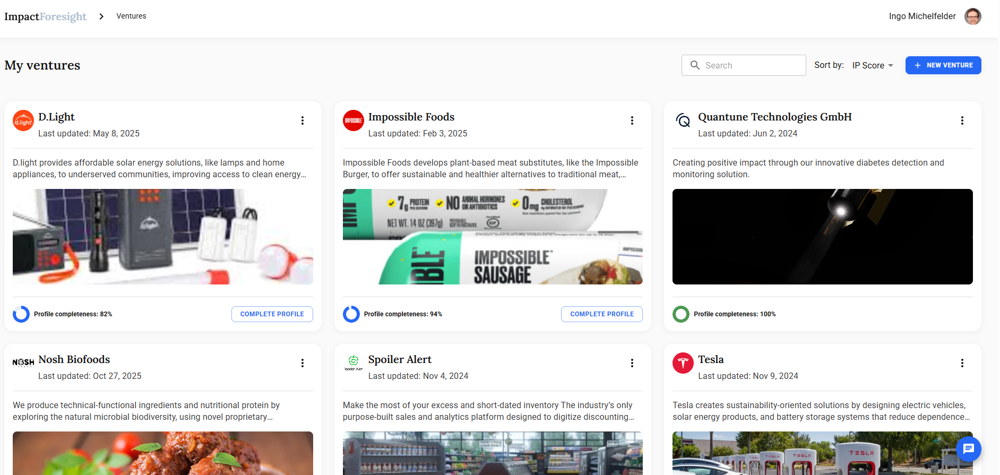
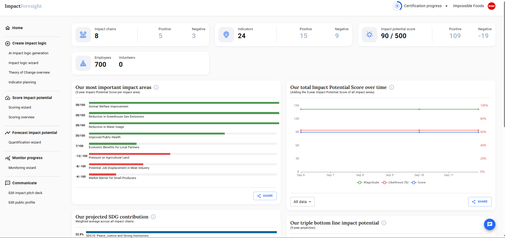
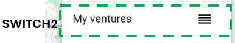

- Keep switch for portfolio managers
- Not needed for portfolio managers nor portfolio companies (In future, for portfolio managers we may add more)

## Slide 4 - Login & Password

Section header.

## Slide 5 - Login Design

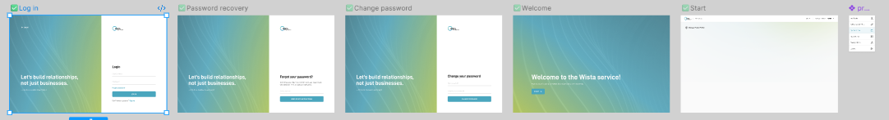

Add WISTA Login, forgot + change password login. Figma Design here: https://www.figma.com/design/eEcRkalXksqhXfSanDLq7G/Impact-foresight-design

Note 1: Current login on app.impactforesight.io is linked to stripe. Not extremely smooth, but functional.

## Slide 6 - Edit User Profile

Section header.

## Slide 7 - Edit Profile Page

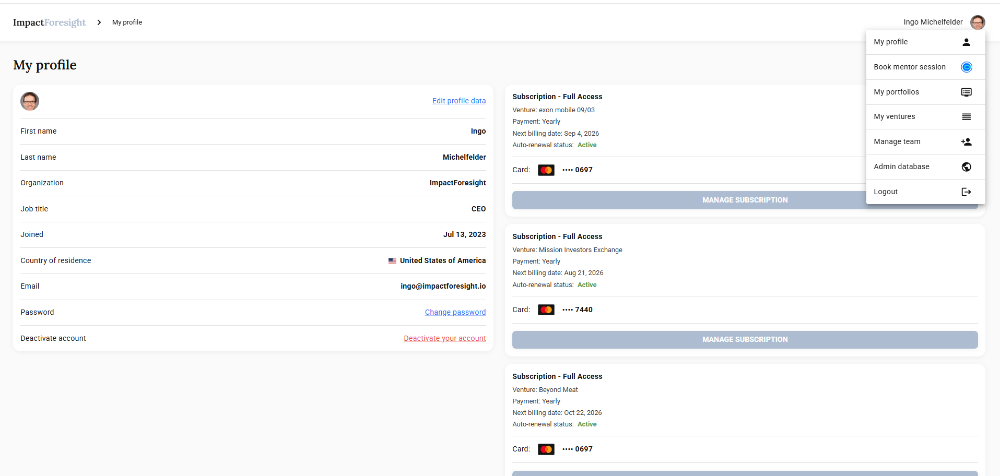
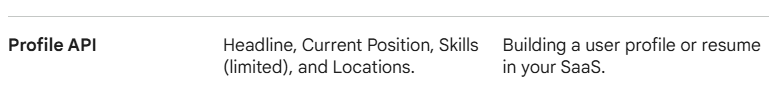

This "edit profile" page is functional, but a bit old-school design. At some point we should revisit.

## Slide 8 - Portfolio Company Menu & Public Profile

Section header.

## Slide 9 - Portfolio Company View

View for portfolio companies. I like the simplicity of this screen. It becomes pretty clear what needs to be done.

- Manage Public Organization Profile
- Maybe call "my organization"

## Slide 10 - Future Portfolio Company Menu

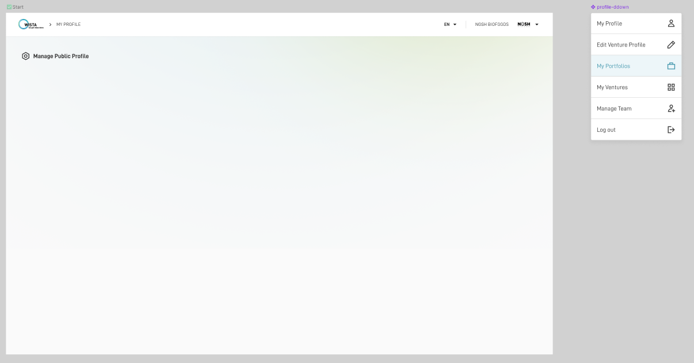
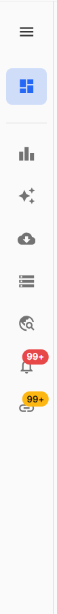

How a portfolio company menu could look like in future (similar to portfolio manager menu):
- Manage Theory of Change
- Manage ESG Materiality Map

## Slide 11 - Manage Public Profile

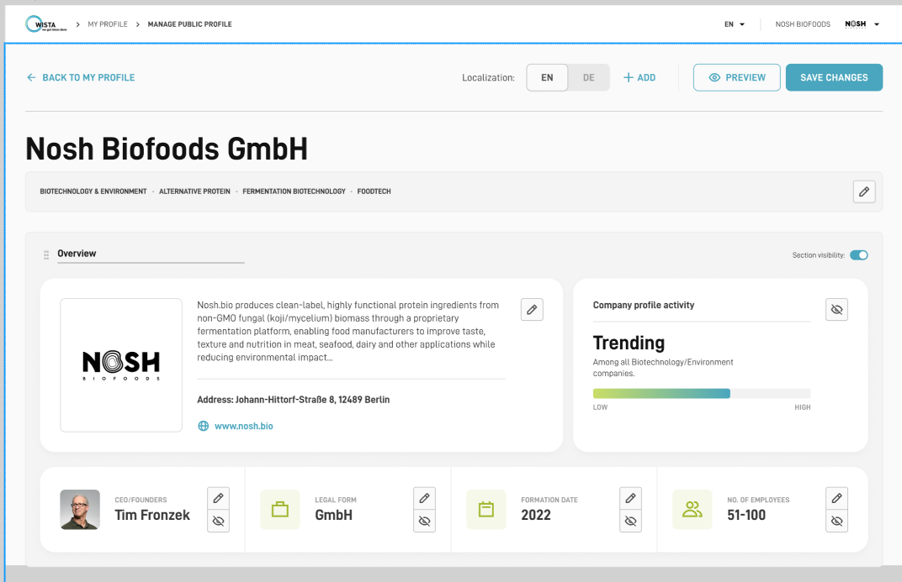

https://www.figma.com/design/eEcRkalXksqhXfSanDLq7G/Impact-foresight-design?node-id=13534-46929

## Slide 12 - Team Management

Section header.

## Slide 13 - Manage Team Screen

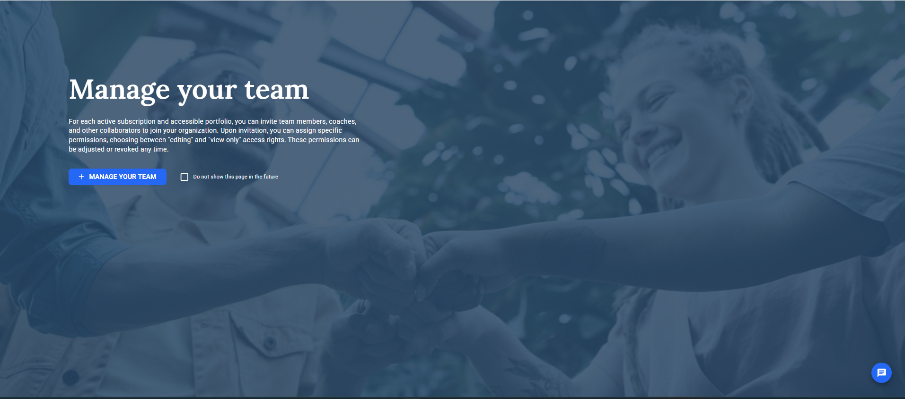

I think we can skip this screen that comes when clicking on "manage team".

## Slide 14 - Team List

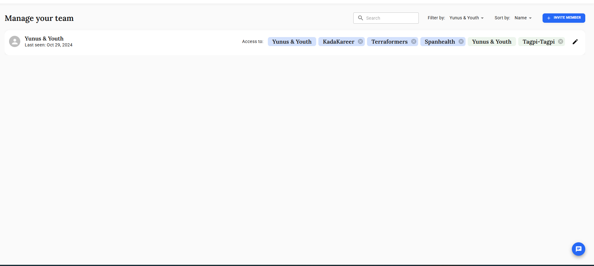

Let's keep this screen the way it is.

## Slide 15 - Team Visualization

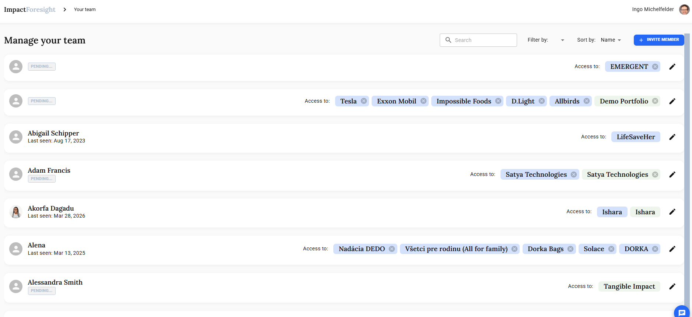

Different visualization. I like the "pending" and "last seen" info.

## Slide 16 - Invite Member (1/2)

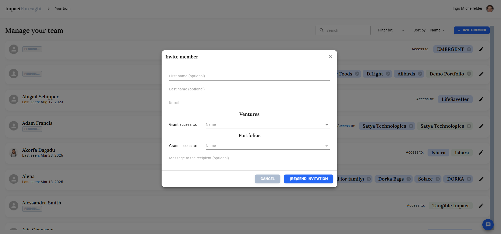

Invite member step 1.

## Slide 17 - Invite Member (2/2)

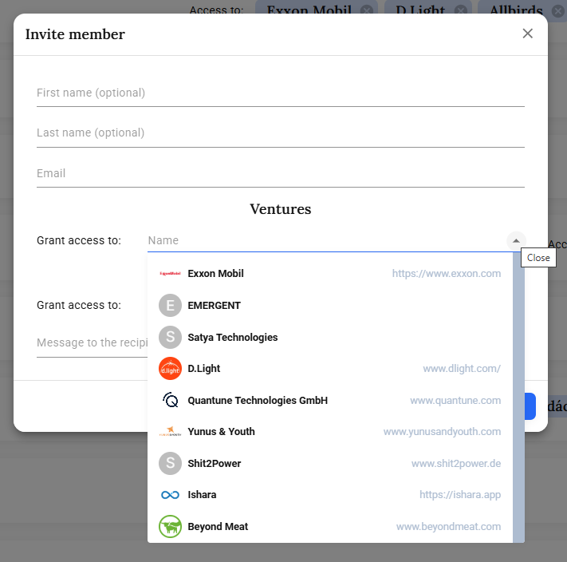
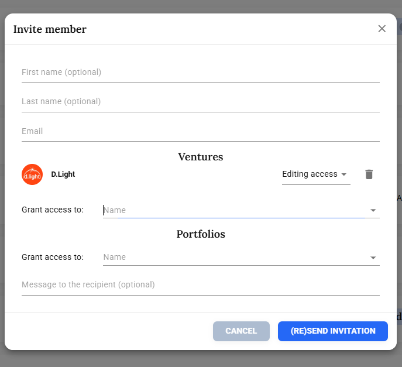
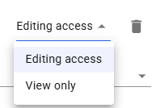

Invitation in old app is 2-step process:
- Select venture
- Select editing access (edit vs. view only)

## Slide 18 - Edit Member Access

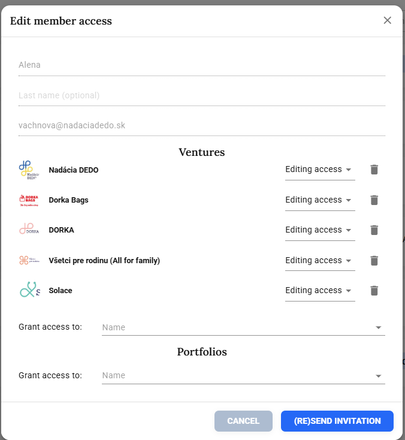
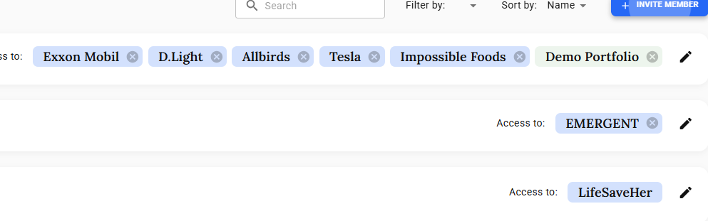

Edit member access (modal when clicking on the "edit" icon for a team member).

## Slide 19 - Discussion Topics

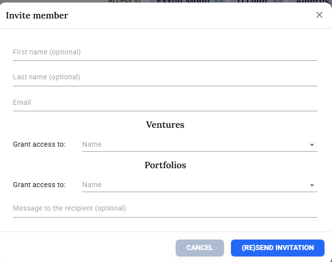

Topics to discuss - Modal functionality:
- No need for "grant access to portfolio" for portfolio companies
- Could we show grant access to ventures in the invite modal?

## Slide 20 - My Portfolios (for portfolio managers)

Section header.

## Slide 21 - Portfolio Selection

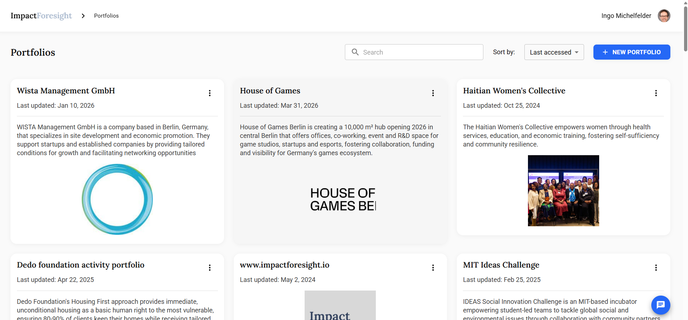

Keep this tile view, to select which portfolio to access.

## Slide 22 - Create New Portfolio

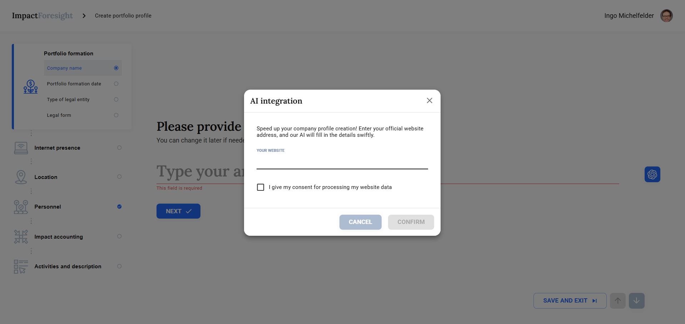

Modal to create a "new portfolio".

Comment: (I think the AI filling of the wizard is broken). You need to fill it manually currently.
